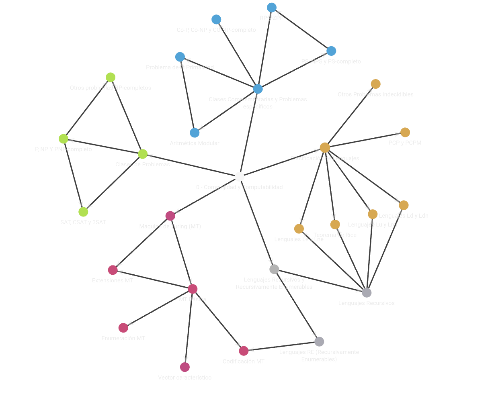

# Complejidad y Computabilidad

Este repositorio contiene los conceptos claves de la asignatura Complejidad y Computabilidad de la UNED.

    

## Como usarlo

Recomiendo trabajar con Obsidian. La idea es completar con conceptos claves con conocimiento.

## Ejemplo

El fichero <Vector característico.md> está complementado con su información correspondiente.
